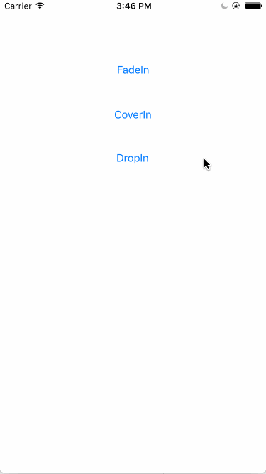

# UIView-MYPop
A Category of UIView to make a view show in the key window.



## Usage

```objc
	import "UIView+MYPop.h"
	
	UIView* aView = [[UIView alloc]initWithFrame:CGRectMake(0, 0, 100, 100)];
    aView.backgroundColor = [UIColor redColor];
    [aView showWithAnimateType:MYPopAnimationTypeFade];
```
